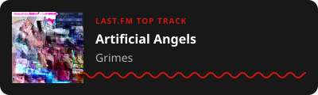

# Last.fm Github profile

Display your current **Last.fm Obsession** or **Top Track** (most played). in your GitHub README.

## 🚀 Usage

Copy the following code into your `README.md` and replace `YOUR_USERNAME`:

```markdown
[](https://www.last.fm/user/YOUR_USERNAME)
```

### Configuration

For detailed API documentation, please refer to [API.md](assets/API.md).

| Parameter | Description                                                           | Default   |
| :-------- | :---------------------------------------------------------------------| :-------- |
| `user`    | Your Last.fm username (required)                                      | -         |
| `bg`      | Background color(e.g. ffffff), 'none' or `transparent`                | `181818`  |
| `width`   | Width of the SVG in pixels (MIN = 120)                                | `400`     |
| `mode`    | Display mode: `smart`, `obsession`, `top`, `recent`, `now`, `list`    | `smart`   |
| `range`   | Date range: `all`, `7day`, `1month`, etc (Requires API Key)           | `all`     |
| `theme`   | Visual theme: `default`, `retro`, `compact`, `osx`                    | `default` |
| `limit`   | Tracks shown when `mode=list` (1-10)                                  | `5`       |

### Modes

- **smart**: Tries to show your Current Obsession. If not set, shows your Top Track (most recent).

> [!WARNING]
>
> - **obsession**: Only shows Current Obsession. Displays an error if none is set.
> - **recent**: Shows your most recent track (Listening History).
> - **top**: Forces the display of "Top Track" label.
> - **now**: Shows now playing track.
> - **list**: Shows your top N tracks by playcount as a small table (`limit`, `range`).

### Example

```markdown
[](https://www.last.fm/user/vlados14311)
```



### Top tracks list

```markdown
[](https://www.last.fm/user/vlados14311)
```


## Deployment

### Self-Hosting with Docker / Podman

If you prefer to host it yourself.

1. **Build the image:**

    ```bash
    podman build -t lastfm-obsession .
    ```

2. **Run the container:**

    ```bash
    podman run -d -p 3000:3000 --name lastfm-obsession lastfm-obsession
    ```

    **With API Key (for Ranges):**

    ```bash
    podman run -d -p 3000:3000 -e LASTFM_API_KEY=your_key --name lastfm-obsession lastfm-obsession
    ```

3. **Access:**
    Your API will be available at `http://YOUR_SERVER_IP:3000/api?user=YOUR_USERNAME`.

> [!NOTE]
> **Creating Custom Themes**
>
> You can easily add your own themes
>
> 1. **Create a Template**: Add a new `.js` file in `lib/templates/`
> 2. **Create Styles**: Add a `.css` file in `lib/styles/`
> 3. **Use**: `&theme=NEW` in the URL
>
> `!Exists theme => Default`

## Features

- **Smart Fallback**: Automatically switches to "Top Track" if no obsession is currently set.
- **Customizable**: Change background color and width.
- **Fast**: Uses Vercel Serverless Functions for low latency.
- **No API Key Required**: Scrapes public profile data, so no need to manage secrets.

## TODO

- [x] Top track in range (LAST FM API REQUIRED)
- [X] Recent track mode
- [ ] Other designs
- [ ] Configuration improvements
